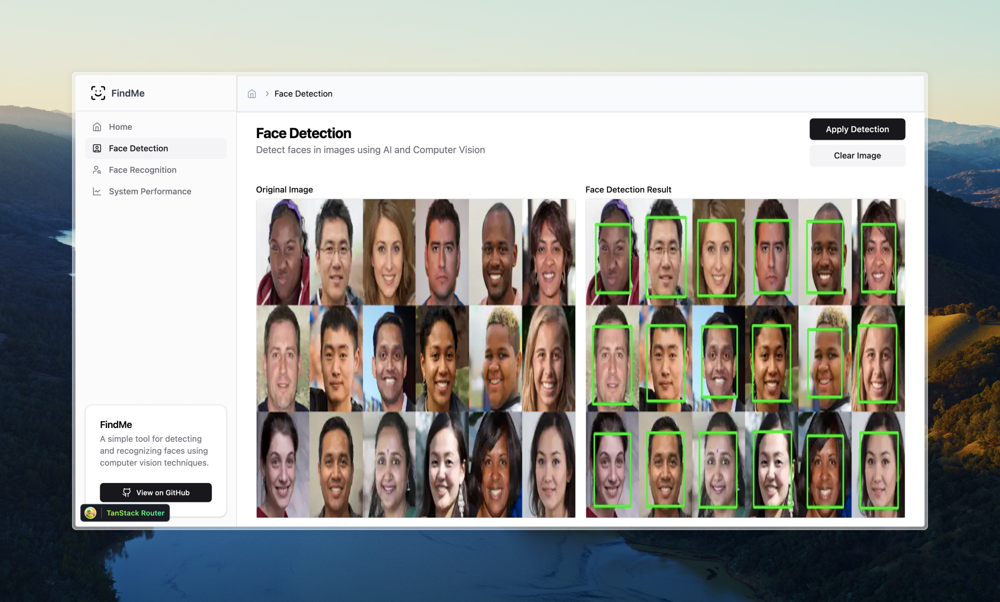
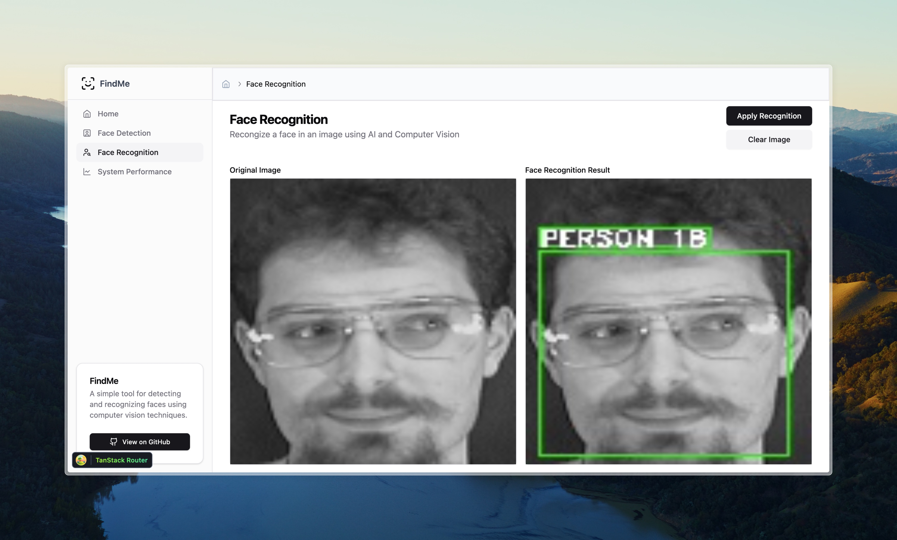
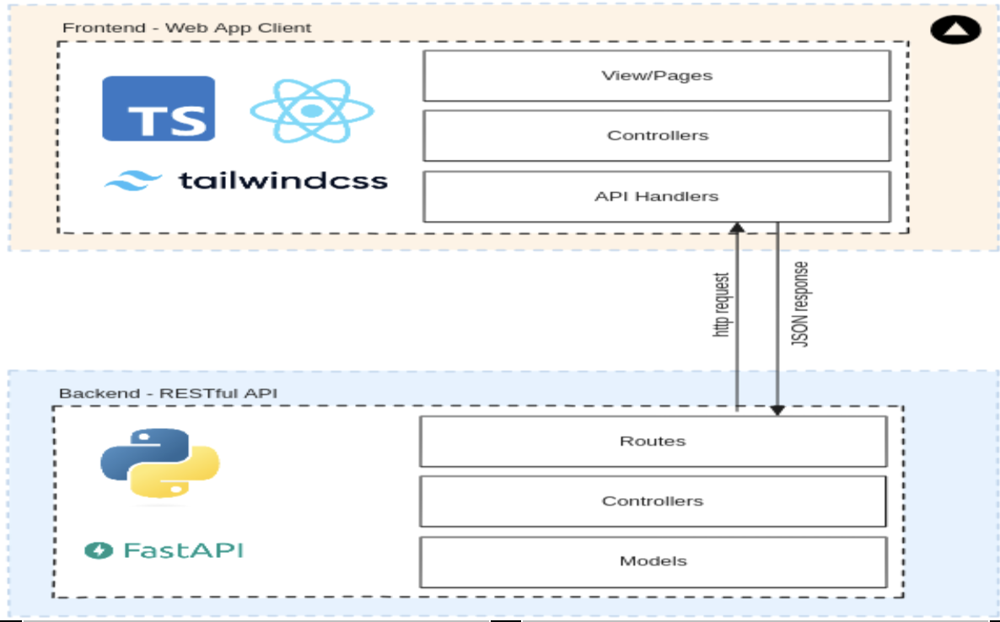

# Find Me Application

## Description

Experimental project that demonstrates face detection and recognition using the studied computer vision algorithms.


### Face Detection

Face detection serves as the initial step in our endeavor. By employing sophisticated algorithms and deep learning models, our system can effectively identify and localize faces within images, regardless of variations in lighting conditions, facial expressions, or poses. This capability finds applications in various domains, including surveillance, human-computer interaction, and digital photography.



### Face Recognition

Building upon the foundation of face detection, our project extends its capabilities to encompass face recognition. This process is built upon our ORL dataset which contains 36 different personal identities, each having 10 different image poses. Through the integration of machine learning algorithms and facial feature extraction techniques, our system can discern unique facial characteristics and match them against our pre-existing dataset of known individuals.

The model used is Support Vector Machine (SVM) and is trained on 7 images out of 10 for each person, while leaving 3 images for evaluation and testing. This functionality opens doors to a multitude of applications, from access control systems to personalized user experiences in social media platforms and e-commerce.

Screenshot showing a **recognized** person:


Screenshot showing an **unrecognized** person:


## Installation

1. Clone the repository

```bash
git clone <repository>
```

2. Navigate to the backend directory and install the dependencies

```bash
cd backend
pip install -r requirements.txt
```

3. Run the backend

```bash
fastapi dev app/main.py
```

4. Navigate to the frontend directory and install the dependencies

```bash
cd ../frontend
npm install
```

5. Add a new file to the frontend directory called `.env` and add the following environment variable

```bash
VITE_API_URL=http://127.0.0.1:8000
```

6. Run the frontend

```bash
npm run dev
```

## Technologies

1. Python
2. FastAPI
3. OpenCV
4. TypeScript
5. React
6. Vite
7. Tailwind CSS

\

